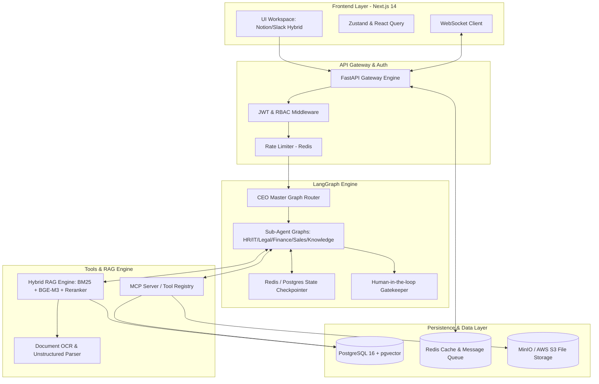
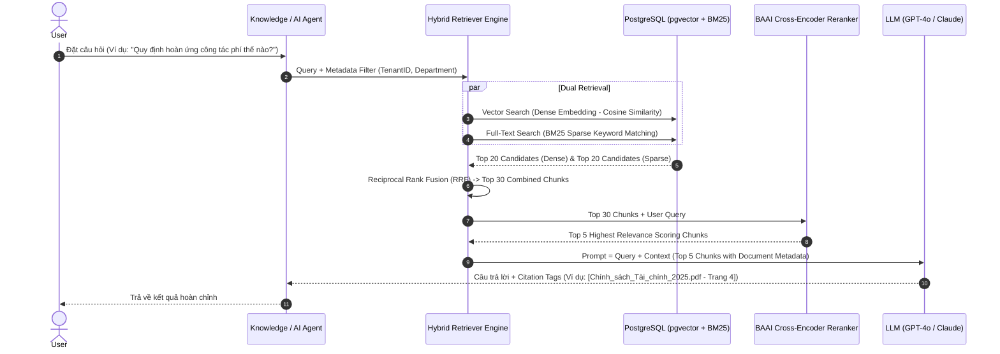
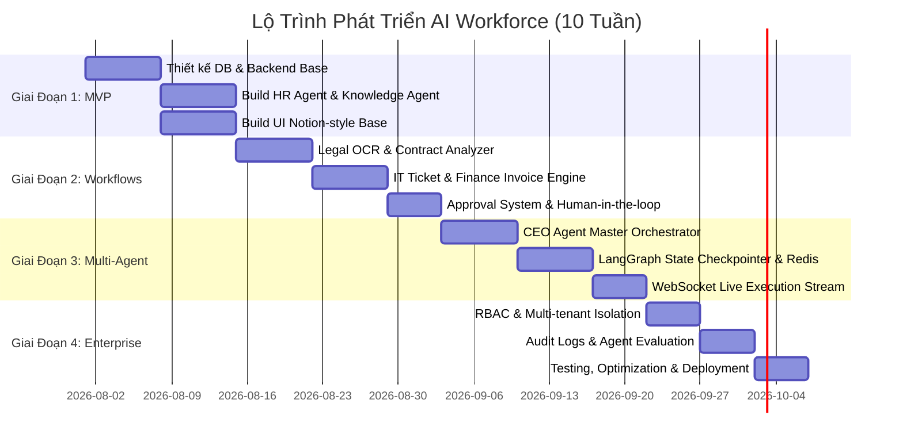

# AI WORKFORCE - ENTERPRISE MULTI-AGENT PLATFORM
## MASTER SYSTEM ARCHITECTURE BLUEPRINT

> **Document Status**: Approved Blueprint  
> **Version**: 1.0.0  
> **Author**: Lead AI Platform Architect  
> **Target System**: Enterprise-grade Autonomous AI Employee Operations  

---

## 1. TỔNG QUAN HỆ THỐNG & TẦM NHÌN SẢN PHẨM (SYSTEM OVERVIEW)

### 1.1 Triết Lý Thiết Kế (Core Vision)
Khác với các ứng dụng Chatbot đơn thuần (User → LLM → Output), **AI Workforce** được xây dựng như một **Doanh Nghiệp Số Ảo (Digital Enterprise)**. Trong đó, các Agent không chỉ là công cụ trả lời câu hỏi mà là những **AI Employees (Nhân Viên AI)** sở hữu:
- **Chức danh & Vai trò rõ ràng** (HR, Legal, IT, Finance, Sales, Knowledge, CEO Orchestrator).
- **Phân quyền thao tác (RBAC)** trên các tài nguyên hệ thống và cơ sở dữ liệu.
- **Bộ nhớ 3 tầng (3-Tier Memory Architecture)**: Short-term, Long-term (Entity/User), và Company Knowledge.
- **Khả năng sử dụng công cụ (Tool Calling & MCP Protocol)**: Truy vấn SQL, tạo báo cáo PDF/Word, gửi Email/Slack, xử lý ticket, RAG tìm kiếm tài liệu.
- **Quy trình làm việc (Workflows & Human-in-the-Loop)**: Cần có phê duyệt của cấp quản lý (Manager/CEO) đối với các hành động nhạy cảm (tăng lương, phê duyệt chi tiêu, duyệt hợp đồng, cấp quyền VPN).

### 1.2 Mô Hình Tổ Chức Doanh Nghiệp AI (AI Workforce Hierarchy)

```mermaid
graph TD
    User([👤 User / Human Employee]) -->|Yêu cầu / Chỉ thị| CEO[👔 CEO Agent - Orchestrator]
    
    subgraph Multi_Agent_Core [Bộ Máy Nhân Viên AI (AI Employees)]
        CEO -->|Phân rã & Điều phối Task| HR[🧑‍💼 HR Agent]
        CEO -->|Phân rã & Điều phối Task| Legal[⚖️ Legal Agent]
        CEO -->|Phân rã & Điều phối Task| IT[💻 IT Agent]
        CEO -->|Phân rã & Điều phối Task| Finance[💰 Finance Agent]
        CEO -->|Phân rã & Điều phối Task| Sales[📈 Sales Agent]
        CEO -->|Phân rã & Điều phối Task| Knowledge[📚 Knowledge Agent]
    end

    HR -->|Tool Calling| DB_HR[(Database SQL)]
    Legal -->|OCR & RAG| Doc_Legal[(Contract Store)]
    IT -->|System API| Ticket_Sys[Jira / Ticket API]
    Finance -->|OCR & Extraction| ERP[(ERP / Invoice DB)]
    Sales -->|Inventory / CRM| CRM_Sys[CRM & Inventory]
    Knowledge -->|Hybrid RAG| Vector_DB[(pgvector / Vector Store)]

    Multi_Agent_Core -->|Human-in-the-loop| Approval{🛡️ Manager Approval}
    Approval -->|Approved| Execute[Thực hiện thay đổi hệ thống & Báo cáo CEO]
```

---

## 2. KIẾN TRÚC KỸ THUẬT TỔNG THỂ (SYSTEM ARCHITECTURE)

### 2.1 Technical Stack Standard

| Tầng (Layer) | Công nghệ đề xuất | Vai trò & Lý do lựa chọn |
| :--- | :--- | :--- |
| **Frontend Framework** | **Next.js 14+ (App Router)** | Rendering SSR/CSR linh hoạt, hỗ trợ Server Components, tối ưu SEO & Performance. |
| **Styling & UI Components** | **Tailwind CSS + shadcn/ui + Lucide** | Giao diện hiện đại, glassmorphism, dark mode, chuẩn Notion + Slack + Jira hybrid. |
| **State & Stream** | **Zustand + TanStack Query + WebSockets** | Quản lý state thời gian thực, nhận stream response từ Agent workflow. |
| **Backend API Gateway** | **Python FastAPI (Async)** | Chuẩn hóa OpenAPI, hiệu năng cao với AsyncIO, dễ tích hợp với hệ sinh thái AI Python. |
| **Multi-Agent Orchestrator** | **LangGraph + MCP (Model Context Protocol)** | Xây dựng stateful agent workflow dạng Graph (DAG), hỗ trợ loop, branching, human-in-the-loop và checkpointer. |
| **Task Queue & Async Workers** | **Celery / ARQ + Redis** | Xử lý các tác vụ AI lâu (OCR, RAG embedding, sinh file Word/PDF, gửi Email hàng loạt). |
| **Database & Vector DB** | **PostgreSQL 16 + pgvector extension** | Lưu trữ quan hệ (Users, Tickets, Contracts) và Vector Embeddings trên cùng 1 hệ thống, dễ backup và quản lý transaction. |
| **Caching & Session Memory** | **Redis Stack** | Cache câu trả lời, lưu trữ Short-term Conversation Memory và Pub/Sub notification. |
| **Embedding & Reranker** | **BGE-M3 + BAAI Reranker v2** | Support Multi-linguality (Việt - Anh), Dense & Sparse Hybrid Search. |
| **LLM Gateway & Router** | **Dynamic Model Router (GPT-4o / Claude 3.5 / Qwen)** | Tối ưu hóa chi phí với phân cấp LLM (Tier 1: Fast/Rẻ, Tier 2: Agent RAG, Tier 3: Legal/Code) & Token Cost Metering. |
| **Self-Correction & Fallback** | **Reflection Node & Model Escalation** | Tự phản biện sửa tham số khi lỗi tool (Max 3 retries) trước khi fallback model hoặc thông báo admin. |

### 2.2 Sơ Đồ Kiến Trúc Hệ Thống Chi Tiết (Detailed Component Architecture)



---

## 3. THIẾT KẾ CÁC NĂNG LỰC CỐT LÕI (CORE MODULE DESIGN)

### 3.1 Bộ Nhớ Agent 3 Tầng (3-Tier Agent Memory System)

1. **Short-Term Memory (Bộ nhớ hội thoại tạm thời)**:
   - Lưu vết trong Redis / Postgres qua `thread_id` của LangGraph.
   - Chứa ngữ cảnh chat của phiên làm việc hiện tại, tự động nén (summarize) khi đạt giới hạn token limit.
2. **Long-Term Memory (Bộ nhớ thực thể / Cá nhân hóa)**:
   - Lưu trữ thông tin cá nhân hóa của nhân viên (Ví dụ: *"Triều thích dùng Python"*, *"Chức vụ: Senior AI Engineer"*).
   - Sử dụng mô hình Extracted Fact Triplets `(Subject, Predicate, Object)` được tự động cập nhật sau mỗi hội thoại.
3. **Company Memory (Kho tri thức & Quy trình doanh nghiệp)**:
   - Lưu trữ Policy, SOP, Tài liệu kỹ thuật, Sản phẩm.
   - Quản lý qua kho RAG có phân quyền truy cập chi tiết (RBAC Document Level).

### 3.2 Phân Rã Chi Tiết 7 AI Employees (AI Agent Roles)

#### 1. CEO Agent (Master Orchestrator)
- **Nhiệm vụ**: Tiếp nhận chỉ thị tổng thể từ người dùng, lập kế hoạch tác vụ (DAG generation), phân rã công việc cho các phòng ban, tổng hợp kết quả và báo cáo.
- **Workflow Ví dụ**: *"Onboard nhân viên Nguyễn Văn A vào vị trí Backend Dev"*.
  - Gọi **HR Agent**: Tạo hồ sơ nhân viên, tính ngày phép, cấp tài liệu onboard.
  - Gọi **IT Agent**: Cấp email công ty, tài khoản Git, quyền VPN.
  - Gọi **Finance Agent**: Cài đặt thông tin lương thưởng.
  - Gọi **Knowledge Agent**: Gửi tài liệu quy định công ty.

#### 2. HR Agent (Quản Trợ Nhân Sự)
- **Công cụ**: `query_employee_sql`, `update_leave_days`, `send_manager_approval_email`, `generate_onboarding_doc`.
- **Workflow Đặc sắc**: Xin nghỉ phép -> Kiểm tra ngày phép dư -> Gửi yêu cầu duyệt cho Manager -> Cập nhật Database -> Gửi thông báo Email/Slack.

#### 3. Legal Agent (Trợ Lý Pháp Lý)
- **Công cụ**: `pdf_ocr_parser`, `contract_clause_analyzer`, `docx_generator`, `legal_rag_search`.
- **Workflow Đặc sắc**: Phân tích rủi ro hợp đồng (Legal Audit) -> Cảnh báo các điều khoản rủi ro -> Đề xuất sửa đổi câu từ -> Xuất file Word (.docx) đã sửa đổi.

#### 4. IT Agent (Hỗ Trợ Kỹ Thuật & Hạ Tầng)
- **Công cụ**: `search_it_kb_rag`, `create_jira_ticket`, `reset_vpn_password`, `check_server_status`.
- **Workflow Đặc sắc**: Nhận báo lỗi VPN -> Tra cứu RAG khắc phục -> Nếu không giải quyết được thì tự động tạo Ticket trên hệ thống -> Assign cho kĩ thuật viên -> Theo dõi trạng thái ticket.

#### 5. Finance Agent (Kế Toán & Tài Chính)
- **Công cụ**: `ocr_invoice_extract`, `reconcile_db_invoice`, `flag_anomaly`, `cfo_alert_slack`.
- **Workflow Đặc sắc**: Xử lý hóa đơn đầu vào -> OCR & Extract số tiền, VAT, mã số thuế -> Trích xuất & So sánh với đơn hàng trong DB -> Cảnh báo lệch giá trị -> Gửi duyệt chi.

#### 6. Sales Agent (Bán Hàng & Tư Vấn)
- **Công cụ**: `search_product_catalog`, `check_inventory_db`, `generate_quote_pdf`, `create_crm_lead`.
- **Workflow Đặc sắc**: Nhận câu hỏi báo giá -> Tìm kiếm tồn kho -> Lập báo giá PDF chính thức -> Đẩy thông tin Khách hàng lên CRM -> Gửi Email tự động.

#### 7. Knowledge Agent (Kho Tri Thức Nội Bộ)
- **Công cụ**: `hybrid_rag_search`, `document_citation_formatter`, `access_filter_search`.
- **Workflow Đặc sắc**: Trả lời bất kỳ thắc mắc nào về chính sách/quy trình của doanh nghiệp đi kèm với **Trích dẫn nguồn chính xác** (Trang, File, Chương).

---

## 4. THIẾT KẾ CƠ SỞ DỮ LIỆU CHUẨN DOANH NGHIỆP (DATABASE DESIGN)

### 4.1 Cơ Sở Dữ Liệu Quan Hệ (PostgreSQL 16 Schema)

```sql
-- 1. Bảng Tổ chức (Multi-Tenant)
CREATE TABLE tenants (
    id UUID PRIMARY KEY DEFAULT gen_random_uuid(),
    name VARCHAR(255) NOT NULL,
    domain VARCHAR(100) UNIQUE NOT NULL,
    created_at TIMESTAMP WITH TIME ZONE DEFAULT CURRENT_TIMESTAMP
);

-- 2. Bảng Người dừng & Phân quyền
CREATE TABLE users (
    id UUID PRIMARY KEY DEFAULT gen_random_uuid(),
    tenant_id UUID REFERENCES tenants(id) ON DELETE CASCADE,
    email VARCHAR(255) UNIQUE NOT NULL,
    full_name VARCHAR(255) NOT NULL,
    password_hash VARCHAR(255) NOT NULL,
    role VARCHAR(50) NOT NULL CHECK (role IN ('CEO', 'Manager', 'Employee', 'Guest')),
    department VARCHAR(50) NOT NULL,
    created_at TIMESTAMP WITH TIME ZONE DEFAULT CURRENT_TIMESTAMP
);

-- 3. Bảng Cấu hình Agent (AI Employee Catalog)
CREATE TABLE ai_agents (
    id UUID PRIMARY KEY DEFAULT gen_random_uuid(),
    tenant_id UUID REFERENCES tenants(id),
    name VARCHAR(100) NOT NULL,
    role_code VARCHAR(50) NOT NULL, -- CEO, HR, LEGAL, IT, FINANCE, SALES, KNOWLEDGE
    system_prompt TEXT NOT NULL,
    model_name VARCHAR(100) DEFAULT 'gpt-4o',
    is_active BOOLEAN DEFAULT TRUE,
    tools_access JSONB DEFAULT '[]'::jsonb
);

-- 4. Bảng Luồng Tác Vụ (Agent Workflows & State)
CREATE TABLE agent_workflows (
    id UUID PRIMARY KEY DEFAULT gen_random_uuid(),
    tenant_id UUID REFERENCES tenants(id),
    initiator_id UUID REFERENCES users(id),
    title VARCHAR(255) NOT NULL,
    status VARCHAR(50) DEFAULT 'PENDING', -- PENDING, IN_PROGRESS, AWAITING_APPROVAL, COMPLETED, FAILED
    current_step INT DEFAULT 0,
    dag_plan JSONB, -- Kế hoạch tác vụ do CEO Agent phân rã
    created_at TIMESTAMP WITH TIME ZONE DEFAULT CURRENT_TIMESTAMP
);

-- 5. Bảng Nhật Ký Phê Duyệt (Human-in-the-Loop Approvals)
CREATE TABLE workflow_approvals (
    id UUID PRIMARY KEY DEFAULT gen_random_uuid(),
    workflow_id UUID REFERENCES agent_workflows(id) ON DELETE CASCADE,
    approver_id UUID REFERENCES users(id),
    action_type VARCHAR(100) NOT NULL, -- e.g., APPROVE_LEAVE, APPROVE_PAYMENT
    payload JSONB NOT NULL,
    status VARCHAR(50) DEFAULT 'WAITING', -- WAITING, APPROVED, REJECTED
    comments TEXT,
    updated_at TIMESTAMP WITH TIME ZONE DEFAULT CURRENT_TIMESTAMP
);

-- 6. Bảng Kho Tài Liệu & Vector Embeddings (pgvector)
CREATE EXTENSION IF NOT EXISTS vector;

CREATE TABLE document_chunks (
    id UUID PRIMARY KEY DEFAULT gen_random_uuid(),
    tenant_id UUID REFERENCES tenants(id),
    document_name VARCHAR(255) NOT NULL,
    department_access VARCHAR(50) DEFAULT 'ALL', -- IT, HR, LEGAL, ALL
    content TEXT NOT NULL,
    metadata JSONB DEFAULT '{}'::jsonb,
    dense_embedding vector(1536), -- OpenAi or BGE-M3 dense vector
    sparse_embedding JSONB, -- BM25 / Sparse representation
    created_at TIMESTAMP WITH TIME ZONE DEFAULT CURRENT_TIMESTAMP
);

-- Hỗ trợ Hybrid Search & HNSW Index
CREATE INDEX ON document_chunks USING hnsw (dense_embedding vector_cosine_ops);
```

---

## 5. KIẾN TRÚC RAG NÂNG CAO (ADVANCED HYBRID RAG PIPELINE)

### 5.1 Luồng Xử Lý Tra Cứu Tri Thức (Hybrid RAG & Reranking Workflow)



---

## 6. GIAO DIỆN NGUYÊN MẪU & UX BLUEPRINT (NOTION + SLACK + JIRA HYBRID)

### 6.1 Layout Tổng Thể (3-Column Layout)

1. **Sidebar Trái (Slack/Notion Style Navigation)**:
   - **CEO Control Room**: Dashboard tổng thể theo dõi KPIs, ticket, tiến độ multi-agent.
   - **Danh Sách AI Employees**: HR 🟢, Legal 🟢, IT 🟢, Finance 🟢, Sales 🟢, Knowledge 🟢.
   - **Kênh Thảo Luận Team**: Channels giao tiếp giữa Human & AI Teams.
   - **Tài Liệu Doanh Nghiệp**: Notion-like Workspace chứa các trang KB.
2. **Khu Vực Trung Tâm (Main Workspace & Chat Experience)**:
   - **Dynamic Canvas**: Hiển thị luồng thực thi LangGraph theo thời gian thực (Interactive DAG Graph).
   - **Chat Thread**: Hỗ trợ Markdown, Rich Components, Form duyệt trực tiếp (Approval Cards with Accept/Reject buttons).
3. **Sidebar Phải (Jira-style Inspector / Agent Specs)**:
   - Trạng thái Agent (Active / Thinking / Tool Executing).
   - Danh sách Tool Agent được phép dùng.
   - Nhật ký Memory & Audit Logs chi tiết từng bước (Step-by-step Execution Log).

---

## 7. LỘ TRÌNH TRIỂN KHAI PHÁT TRIỂN (4-PHASE ROADMAP)



---

## 8. CẤU TRÚC HỒ SƠ TÀI LIỆU CHI TIẾT (DOCUMENTATION STRUCTURE)

Bộ tài liệu kiến trúc **Software Design Document (SDD)** hoàn chỉnh được tổ chức trong thư mục `docs/` như sau:

```
📂 docs/
├── 01-overview.md              # Tổng quan dự án, sứ mệnh, kiến trúc AI Employee
├── 02-requirements.md          # Yêu cầu chức năng (FR) & phi chức năng (NFR)
├── 03-system-architecture.md   # Kiến trúc hệ thống chi tiết & sơ đồ Mermaid
├── 04-database-design.md       # Thiết kế SQL Schema, Indexing & Vector Search
├── 05-agent-design.md          # Chi tiết thiết kế 7 AI Employees & Prompt Engineering
├── 06-rag-system.md            # Đường ống Hybrid RAG, Chunking & Reranking
├── 07-tool-calling.md          # Chuẩn giao tiếp Tool Calling & MCP Protocol
├── 08-workflows.md             # Luồng quy trình doanh nghiệp & Phê duyệt (HITL)
├── 09-api-design.md            # Đặt tả RESTful API & WebSocket Protocols
├── 10-frontend.md              # Giao diện Notion/Slack/Jira Hybrid UX Blueprint
├── 11-deployment.md            # Hướng dẫn đóng gói Docker, CI/CD & Deploy
├── 12-roadmap.md               # Lộ trình chi tiết từng Sprint (10 tuần)
├── 13-future-features.md       # Định hướng mở rộng SaaS Multi-tenant
└── README.md                   # Hướng dẫn tra cứu bộ tài liệu kỹ thuật
```

---

> **Khuyến nghị kiến trúc sư**: Hãy xem file `BLUEPRINT.md` này là kim chỉ nam chính cho toàn bộ quá trình phát triển sản phẩm **AI Workforce**. Mọi thay đổi về Data Schema hoặc Agent Workflow cần được cập nhật đồng bộ vào tài liệu trong thư mục `docs/`.
