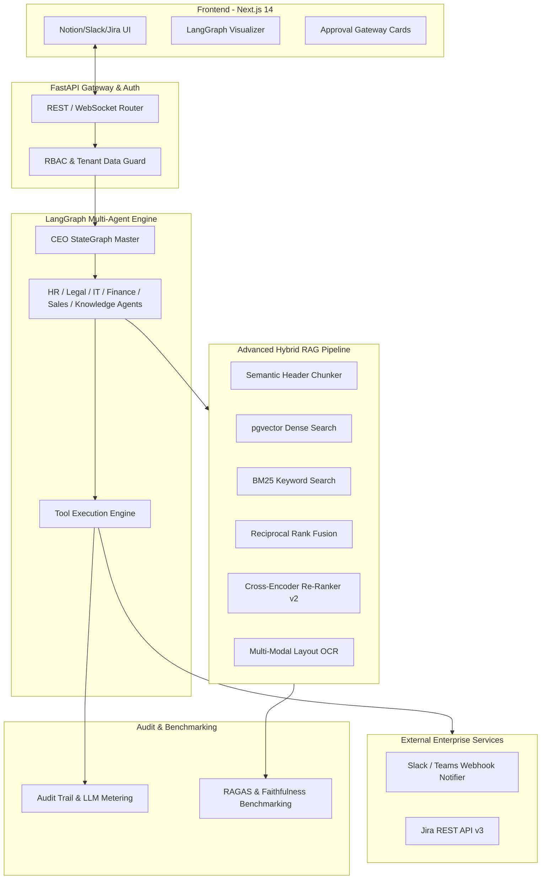

# BLUEPRINT: ADVANCED ENTERPRISE IMPROVEMENTS (PHASE 2)
## AI Workforce — Enterprise Multi-Agent Platform

This document specifies the technical architecture blueprint for advancing the **AI Workforce Platform** to an Enterprise Production-Grade SaaS architecture.

---

## 1. System Architecture Diagram

---

## 2. Advanced Feature Specifications

### 2.1 LangGraph Multi-Agent StateGraph Engine
- **State Schema**: `AgentState` containing `messages`, `next_node`, `task_dag`, `execution_trace`.
- **Dynamic Routing**: Automatic intent routing between HR, Legal, IT, Finance, Sales, and Knowledge agents with zero-shot LLM reasoning and fallback tool dispatching.

### 2.2 Advanced Cross-Encoder Re-Ranking Pipeline
- **Step 1**: Initial Dense Vector Search (pgvector) + Sparse BM25 Search retrieving Top-20 candidate chunks.
- **Step 2**: Reciprocal Rank Fusion (RRF) scoring ($k=60$).
- **Step 3**: Cross-Encoder Re-ranking evaluating sentence pair similarity between query and retrieved context chunks, selecting Top-5 chunks with relevance score > 0.70.

### 2.3 Real-time Redis Pub/Sub Event Bus
- Multi-worker safe event distribution for WebSocket execution graph streaming (`ws://localhost:8000/ws/v1/execution/{thread_id}`).

### 2.4 Enterprise Webhooks (Slack & Jira Integration)
- Outbound Slack/Teams Webhooks broadcasting Approval Cards (`XIN NGHỈ PHÉP`, `DÙNG THẺ TÀI CHÍNH`) directly to management channels.
- Jira REST API v3 payload generation for IT Support ticket creation.

### 2.5 RAGAS & Faithfulness Benchmark Suite
- Automated evaluation measuring:
  - **Faithfulness Score**: Verifies LLM answer is strictly derived from retrieved RAG context.
  - **Answer Relevancy Score**: Evaluates prompt-to-response alignment.
  - **Context Precision & Recall**: Measures retrieval accuracy.
