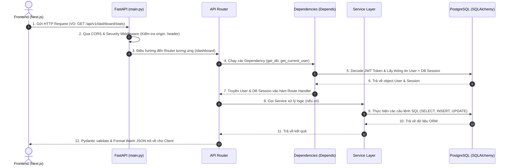

# 🚀 Luồng Hoạt Động & Kiến Trúc Backend FastAPI (AI Workforce)

Tài liệu này giải thích chi tiết luồng hoạt động, kiến trúc thư mục và cách dữ liệu luân chuyển trong hệ thống Backend FastAPI của dự án **AI Workforce**.

---

## 1. Tổng Quan Kiến Trúc (Architecture Overview)

Dự án sử dụng mô hình **Layered Architecture (Kiến trúc phân tầng)** với nguyên tắc **Separation of Concerns** (Phân tách vai trò):

```
       [ Client / Frontend (Next.js) ]
                     │  (HTTP / WebSocket)
                     ▼
       [ FastAPI Application (main.py) ]
                     │  (CORS & Security Middleware)
                     ▼
        [ API Routers (app/api/v1/) ]
                     │
      ┌──────────────┴──────────────┐
      ▼                             ▼
[ Dependency Injection ]     [ Pydantic Schemas ]
 (Auth, JWT, DB Session)      (Validate Input/Output)
      │                             │
      └──────────────┬──────────────┘
                     ▼
        [ Service Layer (app/services/) ]
         (Business Logic, LLM, RAG)
                     │
                     ▼
        [ Database Models (app/models/) ]
         (SQLAlchemy ORM + PostgreSQL)
```

---

## 2. Luồng Xử Lý Của 1 HTTP Request (Request Execution Flow)

Dưới đây là sơ đồ chi tiết từng bước khi 1 Request từ Frontend gửi đến Backend:



---

## 3. Cấu Trúc Thư Mục Backend

```
backend/
├── app/
│   ├── main.py              # 🚀 Entrypoint: Khởi tạo FastAPI App, CORS, Middleware
│   ├── core/                # ⚙️ Cấu hình cốt lõi
│   │   ├── config.py        # Đọc biến môi trường (.env) bằng Pydantic BaseSettings
│   │   ├── database.py      # Tạo kết nối Database Engine & SessionLocal (SQLAlchemy)
│   │   └── security.py      # Băm mật khẩu (bcrypt), Tạo & Xác thực JWT Token
│   ├── models/              # 🗄️ Database Models (SQLAlchemy ORM)
│   │   └── models.py        # Định nghĩa các bảng: User, Tenant, AIAgent, AuditLog, v.v.
│   ├── schemas/             # 📋 Data Validation (Pydantic Models)
│   │   ├── auth.py          # Schemas cho Request/Response Đăng nhập, Đăng ký
│   │   └── ...              # Schemas cho Agents, Documents, Tasks...
│   ├── api/v1/              # 🌐 Controller / API Endpoints
│   │   ├── router.py        # Router tổng gom tất cả các module v1 lại
│   │   ├── auth.py          # Route /api/v1/auth (Login, Register, Refresh)
│   │   ├── dashboard.py     # Route /api/v1/dashboard (Stats, Reports)
│   │   ├── agents.py        # Route /api/v1/agents (Danh sách AI Agents)
│   │   ├── documents.py     # Route /api/v1/documents (Upload & RAG Search)
│   │   └── ...              
│   └── services/            # 🧠 Business Logic Layer (Xử lý nghiệp vụ phức tạp)
│       ├── auth_service.py  # Đăng ký, Đăng nhập, Tạo Refresh Cookie
│       ├── hr_service.py    # Xử lý đơn nghỉ phép, thông tin nhân sự
│       ├── rag_service.py   # Vector Search & RAG với PostgreSQL pgvector
│       └── agents/          # Agent Executor & LangChain/LLM Orchestration
├── tests/                   # 🧪 Automated Unit Tests (Pytest)
├── .env                     # 🔑 Biến môi trường local
└── requirements.txt         # 📦 Danh sách thư viện Python
```

---

## 4. Các Khái Niệm FastAPI Quan Trọng Trong Dự Án

### 4.1. `APIRouter` (Phân luồng API)
Giúp chia nhỏ hệ thống thành các file riêng biệt thay vì viết tất cả trong `main.py`.
- Các router nhỏ nằm ở `app/api/v1/*.py`.
- Được gộp lại tại `app/api/v1/router.py` bằng `api_router.include_router(...)`.

### 4.2. `Depends()` - Dependency Injection (Tiêm phụ thuộc)
Đây là tính năng mạnh nhất của FastAPI. Được dùng cho 2 mục đích chính:
1. **Quản lý kết nối Database (`get_db`)**:
   Mỗi HTTP Request sẽ mở một kết nối DB riêng, sau khi xử lý xong (kể cả khi bị lỗi), kết nối tự động được đóng lại (`yield db`).
2. **Xác thực người dùng (`get_current_user`)**:
   Tự động trích xuất JWT Token từ Header `Authorization: Bearer <token>` hoặc Cookie `access_token`, kiểm tra tính hợp lệ và trả về Object `User` hiện tại.

### 4.3. Pydantic Schemas (`BaseModel`)
Đảm nhận 3 nhiệm vụ:
- **Validate đầu vào**: Tự động báo lỗi HTTP 422 nếu Client gửi thiếu dữ liệu hoặc sai kiểu dữ liệu.
- **Serialize đầu ra**: Tự động chuyển các Object SQLAlchemy thành chuẩn JSON gửi cho Frontend.
- **Tự động sinh API Docs**: Tự tạo tài liệu tương tác tại đường dẫn `/docs` (Swagger UI).

### 4.4. SQLAlchemy ORM (Giao tiếp Database)
Giúp tương tác với PostgreSQL thông qua các class Python thay vì phải viết câu lệnh SQL thô.

---

## 5. Ví Dụ Luồng Chạy Chi Tiết: API `GET /api/v1/dashboard/stats`

Hãy cùng đi qua code thực tế của API Dashboard Stats:

1. **Khách hàng truy cập Dashboard** trên Frontend Next.js.
2. Frontend gọi `api.get("/api/v1/dashboard/stats")`.
3. FastAPI điều hướng request tới hàm `get_dashboard_stats` trong [app/api/v1/dashboard.py](file:///c:/Users/admin/Downloads/code_ai/AI-workforce/backend/app/api/v1/dashboard.py):

```python
@router.get("/stats")
def get_dashboard_stats(
    period: str = Query("week", enum=["day", "week", "month"]), # Validate query param
    db: Session = Depends(get_db),                              # 1. Tiêm DB Session
    current_user: User = Depends(get_current_active_user),      # 2. Tiêm User đã xác thực JWT
):
    tenant_id = current_user.tenant_id

    # Truy vấn thông tin AI Agents thuộc công ty (Tenant) hiện tại
    agents = db.query(AIAgent).filter(AIAgent.tenant_id == tenant_id).all()
    
    # Tính toán số liệu thống kê...
    ...

    # Trả về kết quả JSON cho Frontend
    return {
        "kpi": {...},
        "usage_trend": [...],
        "chatbots": [...]
    }
```

---

## 6. Các Tính Năng Nâng Cao Tích Hợp Sẵn

1. **Multi-Tenant Data Isolation**:
   Mọi câu truy vấn dữ liệu đều bắt buộc phải lọc theo `tenant_id = current_user.tenant_id` để đảm bảo dữ liệu giữa các công ty/khách hàng hoàn toàn độc lập và an toàn.
2. **Xác thực 2 tầng (Access Token + Refresh Cookie)**:
   - `Access Token`: Ngắn hạn, dùng gửi kèm mỗi request để xác thực nhanh.
   - `Refresh Token`: Lưu trong `HttpOnly Cookie` chống tấn công XSS, tự động gia hạn khi Access Token hết hạn.
3. **RAG & Vector Search**:
   Tích hợp PostgreSQL extension `pgvector` để tìm kiếm tri thức doanh nghiệp bằng Embedding Vectors.

---

## 7. Hướng Dẫn Chạy & Debug Cho Người Mới

1. **Chạy Backend Server**:
   ```bash
   cd backend
   uvicorn app.main:app --reload --port 8000
   ```
2. **Xem Tài liệu API Tương Tác (Swagger UI)**:
   Mở trình duyệt truy cập: `http://localhost:8000/docs`
3. **Chạy Bộ Kiểm Thử Tự Động (Unit Tests)**:
   ```bash
   .\venv\Scripts\pytest
   ```

.\venv\Scripts\python.exe -m uvicorn app.main:app --reload