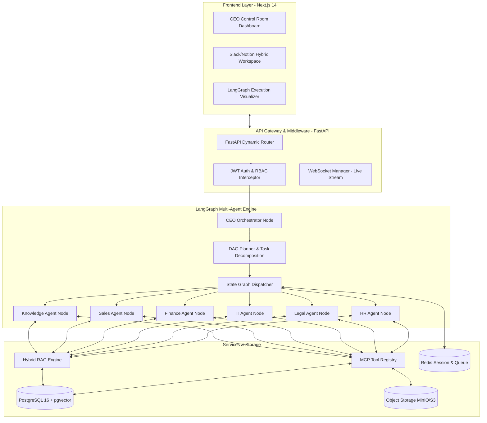
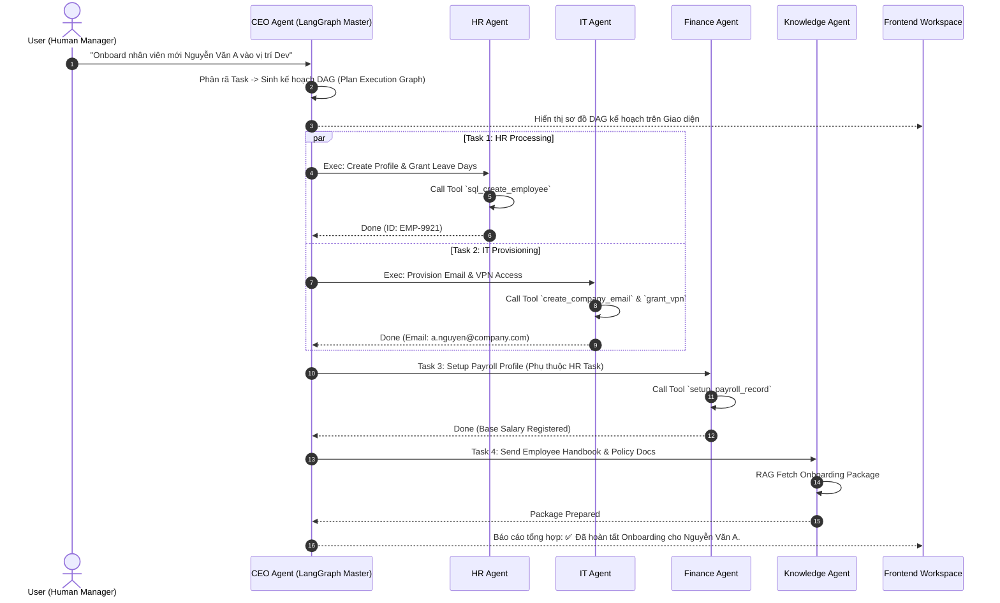
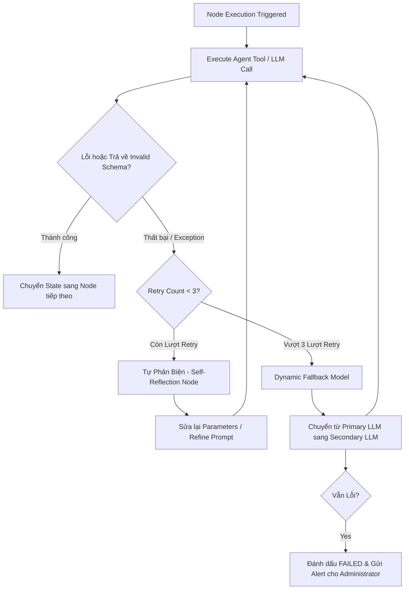

# 03 - KIẾN TRÚC HỆ THỐNG CHI TIẾT (SYSTEM ARCHITECTURE DESIGN)

## 3.1 Sơ Đồ Khối Tổng Thể (High-Level Architecture)



## 3.2 Luồng Điều Phối Của CEO Agent (Orchestration Sequence Diagram)

Dưới đây là chuỗi xử lý chi tiết khi người dùng đưa ra yêu cầu phức tạp liên quan đến nhiều phòng ban: **"Onboard nhân viên mới Nguyễn Văn A"**.



## 3.3 Thiết Kế Trạng Thái LangGraph (State Graph Engine)

State chung được truyền qua toàn bộ các Nút (Nodes) trong LangGraph được định nghĩa bằng Schema Python Pydantic:

```python
from typing import List, Dict, Any, Optional
from pydantic import BaseModel, Field

class AgentTask(BaseModel):
    task_id: str
    assigned_agent: str # HR, LEGAL, IT, FINANCE, SALES, KNOWLEDGE
    description: str
    status: str = "PENDING" # PENDING, IN_PROGRESS, AWAITING_APPROVAL, COMPLETED, FAILED
    result: Optional[Dict[str, Any]] = None
    dependencies: List[str] = []

class MultiAgentState(BaseModel):
    tenant_id: str
    thread_id: str
    initiator_user_id: str
    user_query: str
    dag_plan: List[AgentTask] = []
    current_executing_task_id: Optional[str] = None
    accumulated_context: Dict[str, Any] = {}
    human_approval_required: bool = False
    approval_payload: Optional[Dict[str, Any]] = None
    final_report: str = ""
```

## 3.4 Dynamic LLM Router & Self-Reflection Error Recovery Loop

### 1. Dynamic Model Routing Policy
Để tối ưu hóa chi phí token và thời gian phản hồi, hệ thống áp dụng cơ chế Dynamic LLM Router phân cấp model theo tính chất công việc:

| Loại Tác Vụ (Task Tier) | LLM Recommended | Tiêu chí & Lý do |
| :--- | :--- | :--- |
| **Tier 1: Fast Classification & Routing** | `gpt-4o-mini` / `qwen-2.5-7b` | Phân loại intent, phân tích câu hỏi đơn giản, trích xuất entity cơ bản (Rất nhanh & Rẻ). |
| **Tier 2: General Agent Reasoning & RAG** | `gpt-4o` / `gemini-1.5-pro` | Điều phối multi-agent, trả lời RAG tra cứu tri thức, gọi tools cơ bản. |
| **Tier 3: Complex Reasoning & Legal/Code** | `claude-3-5-sonnet` / `gpt-4o` | Thẩm định hợp đồng pháp lý rủi ro, phân tích hóa đơn tài chính phức tạp, sinh code SQL/Python. |

### 2. Self-Reflection & Fallback Loop Architecture



