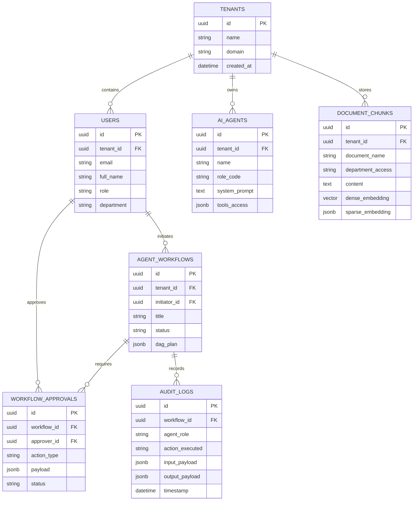

# 04 - THIẾT KẾ CƠ SỞ DỮ LIỆU & VECTOR SEARCH (DATABASE DESIGN)

## 4.1 Sơ Đồ Thực Thể Liên Kết (Entity Relationship Diagram - ERD)



## 4.2 Chi Tiết Các Bảng SQL Chính (DDL Specifications)

### Bảng 1: `users` (Quản Lý Nhân Viên & Phân Quyền)
```sql
CREATE TABLE users (
    id UUID PRIMARY KEY DEFAULT gen_random_uuid(),
    tenant_id UUID NOT NULL REFERENCES tenants(id) ON DELETE CASCADE,
    email VARCHAR(255) UNIQUE NOT NULL,
    full_name VARCHAR(255) NOT NULL,
    password_hash VARCHAR(255) NOT NULL,
    role VARCHAR(50) NOT NULL CHECK (role IN ('CEO', 'Manager', 'Employee', 'Guest')),
    department VARCHAR(50) NOT NULL CHECK (department IN ('BOARD', 'HR', 'LEGAL', 'IT', 'FINANCE', 'SALES', 'ALL')),
    avatar_url TEXT,
    created_at TIMESTAMP WITH TIME ZONE DEFAULT CURRENT_TIMESTAMP,
    updated_at TIMESTAMP WITH TIME ZONE DEFAULT CURRENT_TIMESTAMP
);

CREATE INDEX idx_users_tenant_dept ON users(tenant_id, department);

-- 5. Bảng Nhật Ký Phê Duyệt (Human-in-the-Loop Approvals)
CREATE TABLE workflow_approvals (
    id UUID PRIMARY KEY DEFAULT gen_random_uuid(),
    workflow_id UUID REFERENCES agent_workflows(id) ON DELETE CASCADE,
    approver_id UUID REFERENCES users(id),
    action_type VARCHAR(100) NOT NULL, -- e.g., APPROVE_LEAVE, APPROVE_PAYMENT
    payload JSONB NOT NULL,
    status VARCHAR(50) DEFAULT 'WAITING', -- WAITING, APPROVED, REJECTED, EXPIRED
    expires_at TIMESTAMP WITH TIME ZONE DEFAULT (CURRENT_TIMESTAMP + INTERVAL '48 hours'),
    comments TEXT,
    updated_at TIMESTAMP WITH TIME ZONE DEFAULT CURRENT_TIMESTAMP
);

-- 6. Bảng Bộ Nhớ Dài Hạn Cá Nhân / Thực Thể (Long-Term User/Entity Memory)
CREATE TABLE user_memories (
    id UUID PRIMARY KEY DEFAULT gen_random_uuid(),
    tenant_id UUID REFERENCES tenants(id) ON DELETE CASCADE,
    user_id UUID REFERENCES users(id) ON DELETE CASCADE,
    memory_category VARCHAR(50) NOT NULL, -- PREFERENCE, FACT, SKILL, HISTORY
    memory_key VARCHAR(100) NOT NULL,
    memory_value TEXT NOT NULL,
    confidence_score FLOAT DEFAULT 1.0,
    created_at TIMESTAMP WITH TIME ZONE DEFAULT CURRENT_TIMESTAMP,
    updated_at TIMESTAMP WITH TIME ZONE DEFAULT CURRENT_TIMESTAMP
);

CREATE INDEX idx_user_memories ON user_memories(user_id, memory_category);

-- 7. Bảng Ghi Chi Phí LLM & Token Metering (LLM Token Cost Metering)
CREATE TABLE llm_cost_logs (
    id UUID PRIMARY KEY DEFAULT gen_random_uuid(),
    tenant_id UUID REFERENCES tenants(id),
    workflow_id UUID REFERENCES agent_workflows(id),
    agent_role VARCHAR(50) NOT NULL,
    model_name VARCHAR(100) NOT NULL,
    prompt_tokens INT NOT NULL,
    completion_tokens INT NOT NULL,
    estimated_cost_usd NUMERIC(10, 6) NOT NULL,
    created_at TIMESTAMP WITH TIME ZONE DEFAULT CURRENT_TIMESTAMP
);
```

### Bảng 2: `document_chunks` (Kho Vector Tri Thức doanh nghiệp)
```sql
CREATE EXTENSION IF NOT EXISTS vector;

CREATE TABLE document_chunks (
    id UUID PRIMARY KEY DEFAULT gen_random_uuid(),
    tenant_id UUID NOT NULL REFERENCES tenants(id) ON DELETE CASCADE,
    document_name VARCHAR(255) NOT NULL,
    document_id VARCHAR(100),
    document_title VARCHAR(255),
    document_type VARCHAR(50) NOT NULL DEFAULT 'knowledge',
    version VARCHAR(50) NOT NULL DEFAULT '1.0',
    effective_date DATE,
    expiration_date DATE,
    status VARCHAR(20) NOT NULL DEFAULT 'active',
    confidentiality VARCHAR(30) NOT NULL DEFAULT 'internal',
    allowed_roles JSONB NOT NULL DEFAULT '[]'::jsonb,
    source_file VARCHAR(255),
    department_access VARCHAR(50) DEFAULT 'ALL',
    chunk_index INT NOT NULL,
    section_title VARCHAR(500),
    page INT,
    page_start INT,
    page_end INT,
    content TEXT NOT NULL,
    embedding_text TEXT,
    content_hash VARCHAR(64),
    embedding_model VARCHAR(255),
    embedding_version VARCHAR(100),
    embedding_status VARCHAR(20) DEFAULT 'pending',
    metadata JSONB DEFAULT '{}'::jsonb,
    embedding vector(1024), -- Versioned production embedding
    dense_embedding vector(1536), -- Vector embedding 1536 chiều
    created_at TIMESTAMP WITH TIME ZONE DEFAULT CURRENT_TIMESTAMP
);

-- Indexing HNSW để tối ưu tốc độ tìm kiếm vector tương đồng
CREATE INDEX idx_doc_chunks_hnsw 
ON document_chunks 
USING hnsw (dense_embedding vector_cosine_ops)
WITH (m = 16, ef_construction = 64);

-- Indexing Full-Text Search cho BM25 Keyword Search
CREATE INDEX idx_doc_chunks_fts 
ON document_chunks 
USING gin (to_tsvector('english', content));
```

### Bảng 3: `audit_logs` (Ghi Vết Thao Tác Của Agent)
```sql
CREATE TABLE audit_logs (
    id UUID PRIMARY KEY DEFAULT gen_random_uuid(),
    tenant_id UUID NOT NULL REFERENCES tenants(id),
    workflow_id UUID REFERENCES agent_workflows(id),
    agent_role VARCHAR(50) NOT NULL,
    tool_name VARCHAR(100) NOT NULL,
    input_parameters JSONB,
    output_result JSONB,
    execution_time_ms INT,
    created_at TIMESTAMP WITH TIME ZONE DEFAULT CURRENT_TIMESTAMP
);

CREATE INDEX idx_audit_workflow ON audit_logs(workflow_id);
```

## 4.3 Tối Ưu Hóa Truy Vấn Tìm Kiếm Lai (Hybrid Vector Search Query)

```sql
-- Query tìm kiếm kết hợp Vector Dense + Full Text BM25 với phân quyền Tenant & Department
WITH vector_search AS (
    SELECT id, content, metadata, 1 - (dense_embedding <=> :query_vector) AS dense_score
    FROM document_chunks
    WHERE tenant_id = :tenant_id 
      AND (department_access = 'ALL' OR department_access = :user_department)
    ORDER BY dense_embedding <=> :query_vector ASC
    LIMIT 20
),
fts_search AS (
    SELECT id, content, metadata, ts_rank(to_tsvector('english', content), plainto_tsquery('english', :query_text)) AS fts_score
    FROM document_chunks
    WHERE tenant_id = :tenant_id 
      AND (department_access = 'ALL' OR department_access = :user_department)
      AND to_tsvector('english', content) @@ plainto_tsquery('english', :query_text)
    ORDER BY fts_score DESC
    LIMIT 20
)
SELECT 
    COALESCE(v.id, f.id) AS id,
    COALESCE(v.content, f.content) AS content,
    COALESCE(v.metadata, f.metadata) AS metadata,
    COALESCE(v.dense_score, 0) * 0.7 + COALESCE(f.fts_score, 0) * 0.3 AS final_hybrid_score
FROM vector_search v
FULL OUTER JOIN fts_search f ON v.id = f.id
ORDER BY final_hybrid_score DESC
LIMIT 10;
```
