# 06 - THIẾT KẾ ĐƯỜNG ỐNG TRUY XUẤT TRI THỨC HYBRID RAG (RAG SYSTEM DESIGN)

## 6.1 Tổng Quan Kiến Trúc Advanced RAG Pipeline

```mermaid
flowchart TD
    subgraph Ingestion_Pipeline [Đường Ống Nạp Tài Liệu - Ingestion]
        Doc[File Tài Liệu: PDF / DOCX / Markdown] --> Parser[Layout-aware Document Parser]
        Parser --> OCR[OCR Engine cho Scan PDF / Ảnh]
        OCR --> Chunking[Semantic Header Chunking - 512 Tokens]
        Chunking --> Embedder[Embedding Model: BGE-M3]
        Embedder --> VectorDB[(PostgreSQL - pgvector & BM25 Index)]
    end

    subgraph Query_Pipeline [Đường Ống Tra Cứu - Retrieval & Generation]
        UserQuery[User Question / Agent Query] --> QueryRewrite[Query Rewriter & HyDE Engine]
        QueryRewrite --> DenseSearch[Dense Vector Search - BGE-M3]
        QueryRewrite --> SparseSearch[Sparse Keyword Search - BM25]
        
        DenseSearch & SparseSearch --> RRF[Reciprocal Rank Fusion - RRF]
        RRF --> Reranker[BAAI Cross-Encoder Reranker v2]
        Reranker --> ContextFilter[Access Control & Metadata Filter]
        ContextFilter --> LLMGen[LLM Answer Generation + Citation Engine]
    end
```



## 6.2 Chiến Lược Cắt Khúc Tài Liệu (Chunking Strategy)

- **Kích thước Chunk**: 512 Tokens với Overlap 64 Tokens.
- **Phương pháp**: **Semantic Header-Aware Chunking**. Hệ thống nhận diện các thẻ Tiêu đề (`# H1`, `## H2`, `### H3`) để giữ nguyên ngữ cảnh phân mục trong văn bản.
- **Metadata đi kèm từng Chunk**:
  ```json
  {
    "document_id": "DOC-2025-0811",
    "document_name": "Chinh_sach_Cong_tac_phi_2025.pdf",
    "department_access": "FINANCE",
    "page_number": 14,
    "section_title": "4.2 Chi phí lưu trú khách sạn",
    "created_at": "2026-07-27T10:00:00Z"
  }
  ```

## 6.3 Thuật Toán Kết Hợp Reciprocal Rank Fusion (RRF Algorithm)

Phương pháp RRF kết hợp điểm xếp hạng từ 2 chiến lược Vector Search (Dense) và Keyword Search (Sparse):

$$\text{RRF Score}(d) = \sum_{m \in M} \frac{1}{k + r_m(d)}$$

- Trong đó: $k = 60$ (hằng số điều hòa), $r_m(d)$ là thứ hạng của tài liệu $d$ trong danh sách kết quả $m$.
- Kết quả RRF giúp loại bỏ hạn chế của tìm kiếm vector khi gặp các từ khóa mã sản phẩm/tên riêng kỹ thuật.

## 6.4 Mô Hình Reranker (Cross-Encoder Re-Ranking)
Top 30 kết quả sau RRF sẽ được đưa qua mô hình **BAAI/bge-reranker-v2-m3** để tính toán lại điểm tương quan trực tiếp giữa câu hỏi và đoạn văn bản. Chỉ **Top 5 đoạn văn có điểm cao nhất (> 0.7)** mới được nạp vào Prompt của LLM để đảm bảo tối ưu hóa chi phí token và loại bỏ nhiễu.
