# 06 - THIẾT KẾ ĐƯỜNG ỐNG TRUY XUẤT TRI THỨC HYBRID RAG (RAG SYSTEM DESIGN)

## 6.1 Tổng Quan Kiến Trúc Advanced RAG Pipeline

```mermaid
flowchart TD
    subgraph Ingestion_Pipeline [Đường Ống Nạp Tài Liệu - Ingestion]
        Doc[File Tài Liệu: PDF / DOCX / Markdown] --> Parser[Layout-aware Document Parser]
        Parser --> OCR[OCR Engine cho Scan PDF / Ảnh]
        OCR --> Cleaning[Conservative Text Cleaning]
        Cleaning --> Chunking[Semantic-first Chunking - max 700 Tokens]
        Chunking --> Hash[SHA-256 Deduplication]
        Hash --> Embedder[Versioned Embedding Model - 1024 dims]
        Embedder --> VectorDB[(PostgreSQL - pgvector & BM25 Index)]
    end

    subgraph Query_Pipeline [Đường Ống Tra Cứu - Retrieval & Generation]
        UserQuery[User Question / Agent Query] --> QueryRewrite[Query Rewriter & HyDE Engine]
        QueryRewrite --> DenseSearch[Dense Vector Search - BGE-M3]
        QueryRewrite --> SparseSearch[Sparse Keyword Search - BM25]
        
        DenseSearch & SparseSearch --> RRF[Reciprocal Rank Fusion - RRF]
        RRF --> Reranker[BAAI Cross-Encoder Reranker v2]
        Reranker --> ContextFilter[Access Control & Metadata Filter]
        ContextFilter --> LLMGen[LLM Answer Generation + Citation Engine]
    end
```



## 6.2 Chiến Lược Cắt Khúc Tài Liệu (Chunking Strategy)

- **Semantic-first**: ưu tiên tách theo Heading, Điều, Khoản, Bước trong quy trình, mục Trách nhiệm và mục Điều kiện. Các section ngắn không bị gộp hoặc cắt chỉ để đạt kích thước cố định.
- **Token fallback**: chỉ section vượt ngưỡng cấu hình mới được chia tiếp; cấu hình mặc định `min=100`, `target=450`, `max=700`, `overlap=80`.
- **Ngữ cảnh phân cấp**: mỗi chunk giữ `section_type`, `section_title`, `header_path`, số trang bắt đầu và danh sách trang liên quan.
- **Governance trước retrieval**: mọi truy vấn phải lọc theo tenant, phòng ban, role, trạng thái, ngày hiệu lực, ngày hết hạn và mức bảo mật trước khi xếp hạng.
- **Metadata đi kèm từng Chunk**:
  ```json
  {
    "id": "chunk-uuid",
    "tenant_id": "company_a",
    "department": "HR",
    "document_type": "policy",
    "document_id": "leave-policy-2026",
    "document_title": "Chính sách nghỉ phép",
    "section_title": "Quy trình xin nghỉ",
    "content": "Nhân viên phải gửi yêu cầu...",
    "version": "2.1",
    "effective_date": "2026-07-01",
    "expiration_date": null,
    "status": "active",
    "confidentiality": "internal",
    "allowed_roles": ["employee", "hr", "manager"],
    "source_file": "leave_policy_v2.1.pdf",
    "page": 4
  }
  ```

- **Embedding input**: chỉ đưa phòng ban, loại tài liệu, tên tài liệu, section và nội dung vào model. Tenant, ACL, status và ngày hiệu lực chỉ dùng làm database filter.
- **Versioning**: lưu `content_hash`, `embedding_model` và `embedding_version`; chunk không đổi được tái sử dụng vector, version tài liệu cũ được chuyển sang `inactive`.
- **Lifecycle**: document đi qua `uploaded → parsing → chunking → embedding → indexing → ready`; lỗi được giữ ở trạng thái `failed` cùng thông báo để retry/audit.

## 6.3 Thuật Toán Kết Hợp Reciprocal Rank Fusion (RRF Algorithm)

Phương pháp RRF kết hợp điểm xếp hạng từ 2 chiến lược Vector Search (Dense) và Keyword Search (Sparse):

$$\text{RRF Score}(d) = \sum_{m \in M} \frac{1}{k + r_m(d)}$$

- Trong đó: $k = 60$ (hằng số điều hòa), $r_m(d)$ là thứ hạng của tài liệu $d$ trong danh sách kết quả $m$.
- Kết quả RRF giúp loại bỏ hạn chế của tìm kiếm vector khi gặp các từ khóa mã sản phẩm/tên riêng kỹ thuật.

## 6.4 Mô Hình Reranker (Cross-Encoder Re-Ranking)
Top 30 kết quả sau RRF sẽ được đưa qua mô hình **BAAI/bge-reranker-v2-m3** để tính toán lại điểm tương quan trực tiếp giữa câu hỏi và đoạn văn bản. Chỉ **Top 5 đoạn văn có điểm cao nhất (> 0.7)** mới được nạp vào Prompt của LLM để đảm bảo tối ưu hóa chi phí token và loại bỏ nhiễu.
