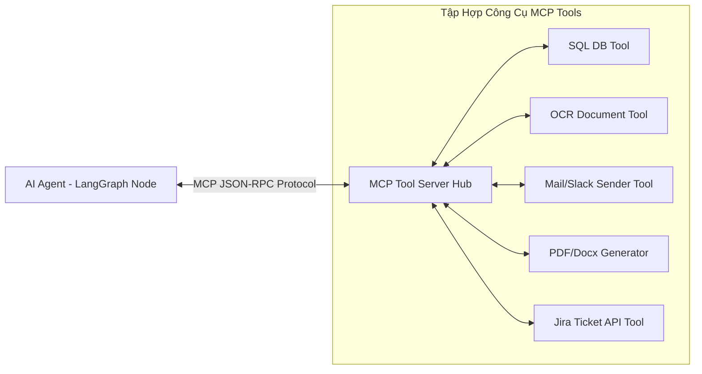

# 07 - CHUẨN GIAO TIẾP TOOL CALLING & MCP PROTOCOL (TOOL CALLING DESIGN)

## 7.1 Chuẩn Model Context Protocol (MCP) Integration
Hệ thống ứng dụng **Model Context Protocol (MCP)** làm giao thức chuẩn hóa để các AI Agents kết nối tới các dịch vụ bên ngoài (Databases, APIs, File Generators, Email Gateways).



## 7.2 Danh Sách & Interface Của Các Tools Chính

### 1. Tool: `query_employee_sql` (HR Agent Tool)
- **Mô tả**: Cho phép HR Agent truy vấn dữ liệu nhân viên từ SQL Database với các câu lệnh `SELECT` đã qua kiểm duyệt.
- **Input Schema (JSON Schema)**:
  ```json
  {
    "type": "object",
    "properties": {
      "user_email": { "type": "string", "description": "Email nhân viên cần tra cứu" },
      "target_field": { "type": "string", "enum": ["leave_balance", "salary_grade", "department", "onboarding_status"] }
    },
    "required": ["user_email", "target_field"]
  }
  ```

### 2. Tool: `analyze_contract_risk` (Legal Agent Tool)
- **Mô tả**: Nhận đường dẫn file hợp đồng PDF, thực hiện OCR và phân tích điều khoản rủi ro.
- **Input Schema**:
  ```json
  {
    "type": "object",
    "properties": {
      "file_url": { "type": "string", "description": "URL của file hợp đồng đã upload" },
      "strictness_level": { "type": "string", "enum": ["LOW", "MEDIUM", "HIGH"] }
    },
    "required": ["file_url"]
  }
  ```

### 3. Tool: `generate_quotation_pdf` (Sales Agent Tool)
- **Mô tả**: Tự động sinh file PDF Báo Giá từ danh sách sản phẩm và gửi Email cho Khách hàng.
- **Input Schema**:
  ```json
  {
    "type": "object",
    "properties": {
      "customer_email": { "type": "string" },
      "items": {
        "type": "array",
        "items": {
          "properties": {
            "product_code": { "type": "string" },
            "quantity": { "type": "integer" },
            "unit_price": { "type": "number" }
          }
        }
      }
    },
    "required": ["customer_email", "items"]
  }
  ```

## 7.3 Kiểm Soát An Toàn Khi Gọi Tool (Tool Execution Security Guardrails)

1. **SQL Injection Defense**: Tuyệt đối không cho phép LLM tự viết string SQL ngẫu nhiên. Mọi truy vấn SQL phải thông qua các hàm ORM (SQLAlchemy) với tham số hóa (Parameterized Queries).
2. **Access Permission Checking**: Trước khi thực thi Tool, MCP Server đối chiếu Token Vai trò (User Role) với Bảng Cấu hình Phân quyền của Tool.
3. **Execution Sandbox**: Các đoạn code tự sinh (Python Interpreter Tool) bắt buộc phải chạy trong môi trường Docker Container cô lập (Restricted Container Sandbox).
