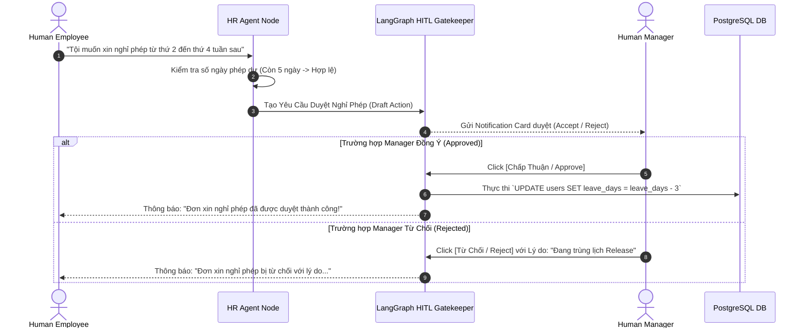

# 08 - QUY TRÌNH NGHIỆP VỤ & PHÊ DUYỆT TƯƠNG TÁC NGƯỜI (HUMAN-IN-THE-LOOP WORKFLOWS)

## 8.1 Cơ Chế Human-In-The-Loop (HITL Architecture)
Trong môi trường doanh nghiệp thực tế, nhiều hành động do AI đề xuất không được phép thực thi tự động nếu chưa có sự phê duyệt của Quản lý con người (Human Manager).

## 8.2 Phân Rã Các Quy Trình Nghiệp Vụ Cốt Lõi (Core Business Workflows)

### 1. Quy Trình 1: Xử Lý Sự Cố Hạ Tầng IT & Ticket Lifecycle
1. User nhập báo lỗi: *"Máy tính không vào được VPN công ty"*.
2. IT Agent tiếp nhận, gọi `search_it_kb_rag` để tìm bài viết khắc phục sự cố.
3. Trả về hướng dẫn các bước tự xử lý cho User.
4. Hỏi User: *"Bạn đã kết nối thành công chưa?"*.
5. Nếu User báo chưa: IT Agent tự động kích hoạt `create_jira_ticket` để sinh Ticket hỗ trợ, gán cho Nhân viên IT ca trực và gửi đường link Ticket cho User theo dõi.

### 2. Quy Trình 2: Thẩm Định Hợp Đồng Pháp Lý (Legal Audit Workflow)
1. User upload file `Hop_Dong_Mua_Ban_2025.pdf`.
2. Legal Agent thực hiện `ocr_contract_pdf` -> Tách văn bản thành các điều khoản.
3. So sánh các điều khoản với Kho Tri Thức Pháp Lý (`legal_rag_search`).
4. Xuất Báo cáo Thẩm định Rủi ro:
   - 🔴 **Rủi ro cao**: Điều khoản 8.2 (Phạt vi phạm 30% giá trị hợp đồng - Vượt quá quy định Luật Thương mại).
   - 🟡 **Cảnh báo**: Điều khoản 12.1 (Không quy định rõ thời hạn thanh toán).
5. Sinh file Word `.docx` đã đề xuất sửa đổi và gửi nút [Tải Về Hợp Đồng Đã Sửa].

### 3. Quy Trình 3: Xử Lý Hóa Đơn Đầu Vào (Finance Invoice Processing)
1. User gửi ảnh/PDF hóa đơn tài chính.
2. Finance Agent chạy `ocr_invoice_extract` để trích xuất: Mã Số Thuế, Tên Công Ty, Tổng Tiền, Tiền Thẻ VAT.
3. Thực hiện `reconcile_po_db` để kiểm tra với Đơn Đặt Hàng (Purchase Order) lưu trong SQL.
4. Nếu tổng tiền khớp: Tự động ghi nhận vào sổ sách kế toán.
5. Nếu tổng tiền chênh lệch > 5%: Gửi cảnh báo đỏ cho CFO và tạm dừng quy trình để chờ xác nhận.

## 8.3 Xử Lý Hạn Chót Phê Duyệt & Nhắc Nhở Tự Động (Approval Expiration Policy)

Để tránh trường hợp các quy trình bị ngưng trệ vô thời hạn do Quản lý quên duyệt:
1. **Reminder Cron Job (Nhắc nhở tự động)**: Sau 24 giờ kể từ khi phát sinh Card phê duyệt, Celery Beat worker tự động gửi notification qua Slack/Email nhắc Quản lý.
2. **Auto-Expiration / Escalation (Tự động chuyển tiếp/Hết hạn)**: Sau 48 giờ không có phản hồi:
   - Trạng thái Yêu cầu chuyển thành `EXPIRED`.
   - Gửi cảnh báo chuyển tiếp (Escalate) lên CEO hoặc Quản lý cấp cao hơn.
   - Trạng thái LangGraph DAG chuyển sang nhánh xử lý tạm dừng an toàn (Safe Pause Branch).

