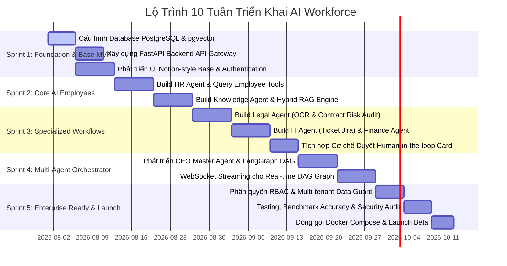

# 12 - LỘ TRÌNH PHÁT TRIỂN CHI TIẾT 10 TUẦN (DEVELOPMENT ROADMAP)

## 12.1 Kế Hoạch Triển Khai Theo Sprint (5 Sprints - 10 Tuần)

---

## 12.2 Mục Tiêu Chi Tiết Từng Sprint

### 🎯 Sprint 1 (Tuần 1–2): Khởi Tạo Hạ Tầng & Authentication
- [x] Khởi tạo Postgres DB, cài đặt extension `pgvector`, chạy Migration script ban đầu.
- [x] Thiết lập FastAPI Server với OpenAPI documentation tự động.
- [x] Tạo Giao diện Next.js 14 cơ bản với Tailwind CSS + shadcn/ui.
- [x] Tích hợp Auth JWT (Login, Logout, Role Guard middleware).

### 🎯 Sprint 2 (Tuần 3–4): HR Agent & Kho Tri Thức Hybrid RAG
- [x] Xây dựng HR Agent xử lý quy trình xin nghỉ phép và hỏi đáp quy định.
- [x] Cấu hình đường ống Ingestion nạp file PDF/Docx vào PostgreSQL `document_chunks`.
- [x] Triển khai Hybrid Search (BGE-M3 Dense Vector + BM25 Full-text Search) + BAAI Reranker v2.
- [x] Trả lời câu hỏi có thẻ Trích Dẫn Nguồn (Citation Tags).

### 🎯 Sprint 3 (Tuần 5–6): Agents Chuyên Môn & Phê Duyệt Con Người (HITL)
- [x] Xây dựng Legal Agent: OCR PDF hợp đồng, phân tích điều khoản rủi ro, xuất file `.docx`.
- [x] Xây dựng IT Agent: Tra cứu RAG và tự động sinh Jira Ticket khi gặp sự cố kỹ thuật.
- [x] Xây dựng Finance Agent: OCR hóa đơn, đối chiếu PO Database.
- [x] Triển khai UI Approval Card cho phép Quản lý duyệt/từ chối yêu cầu nghỉ phép & cấp quyền.

### 🎯 Sprint 4 (Tuần 7–8): CEO Orchestrator & Stream Graph
- [x] Xây dựng CEO Master Agent bằng LangGraph State Graph.
- [x] Lập kế hoạch DAG tác vụ tự động cho các chỉ thị phức tạp (Onboarding, Báo cáo quý).
- [x] Stream trạng thái thực thi của Graph qua WebSocket lên Giao diện Visualizer.

### 🎯 Sprint 5 (Tuần 9–10): Kiểm Thử, Bảo Mật & Đóng Gói
- [x] Kiểm tra phân quyền RBAC và cô lập dữ liệu Multi-Tenant.
- [x] Ghi vết Audit Logs đầy đủ cho tất cả thao tác của Agent.
- [x] Đóng gói toàn bộ ứng dụng bằng Docker Compose.
- [x] Triển khai môi trường thử nghiệm Beta.
