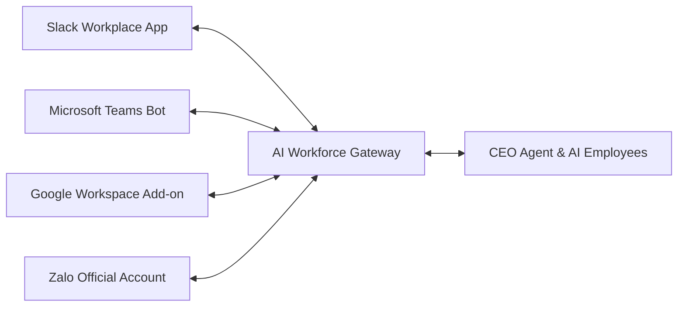

# 13 - ĐỊNH HƯỚNG MỞ RỘNG SAAS VÀ ĐÁNH GIÁ AGENT (FUTURE EXTENSIONS)

## 13.1 Định Hướng Mở Rộng Hệ Thống SaaS Multi-Tenant

Để biến **AI Workforce** từ một sản phẩm nội bộ thành một nền tảng B2B SaaS thương mại, kiến trúc cần nâng cấp các tính năng sau:

1. **Multi-Tenant Schema Isolation**:
   - Sử dụng mô hình *Schema-per-Tenant* trong PostgreSQL (mỗi công ty 1 DB Schema riêng) để đảm bảo an toàn tuyệt đối cho dữ liệu doanh nghiệp.
2. **Custom Agent Builder (Agent Studio)**:
   - Cho phép Quản trị viên doanh nghiệp tự tạo AI Employee mới (ví dụ: Marketing AI Agent, QA AI Agent) qua giao diện kéo thả (No-Code Agent Builder).
   - Tải lên bộ System Prompt riêng và chọn danh sách Tools được phép cấp quyền.
3. **Billing & Token Quota Metering**:
   - Đo lường dung lượng Token LLM tiêu thụ của từng tổ chức theo thời gian thực.
   - Giới hạn hạn ngạch (Rate Limiting & Tiered Subscription Plans: Starter, Professional, Enterprise).

---

## 13.2 Tích Hợp Kênh Truyền Thông Doanh Nghiệp (External Integrations)

- **Slack / Teams Bot Integration**: Nhân viên có thể trực tiếp chat với HR Agent hoặc IT Agent ngay trong ứng dụng Slack/Teams bằng lệnh `@HRAgent` hoặc `@ITAgent`.
- **Google Workspace / Office 365 Connector**: Tự động đồng bộ lịch họp (Google Calendar), gửi Gmail và cập nhật tài liệu trên Google Drive / OneDrive.

---

## 13.3 Đánh Giá Hiệu Năng & Độ Chính Xác Của Agent (Agent Evaluation Framework)

Để đảm bảo các AI Agent hoạt động ổn định và không phát sinh lỗi hallucination, hệ thống cần thiết lập bộ kiểm thử tự động **LLM-as-a-Judge**:

1. **Faithfulness Score (Độ trung thực RAG)**: Đo lường tỷ lệ thông tin câu trả lời được rút ra trực tiếp từ các Chunks tài liệu RAG, tránh bị bịa đặt.
2. **Tool Selection Accuracy**: Đánh giá khả năng chọn đúng Tool và sinh đúng tham số JSON Schema của Agent khi nhận câu hỏi của người dùng.
3. **Execution Success Rate (ESR)**: Tỷ lệ tác vụ quy trình (Workflow) hoàn thành công việc thành công mà không gặp ngoại lệ hệ thống.
